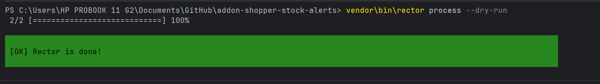
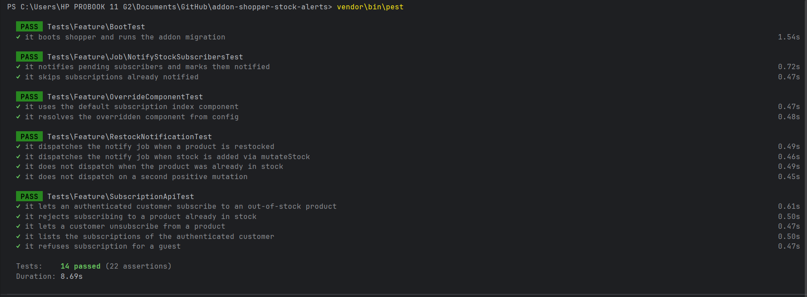

# Quality Report

Environment: PHP 8.3, Laravel 13, Shopper 3.x.

All checks below were run on the final `v1.0.0` state of the package.

## Laravel Pint

Command: 
```bash
    vendor/bin/pint --test
```

\`\`\`

\`\`\`

## PHPStan (level 9)

Command: 
```bash
  vendor/bin/phpstan analyse
```

\`\`\`

\`\`\`

## Rector (dry-run)

Command: 
```bash
  vendor/bin/rector process --dry-run
```

\`\`\`

\`\`\`

## Tests (Pest)

Command: 
```bash
  vendor/bin/pest
```

\`\`\`

\`\`\`